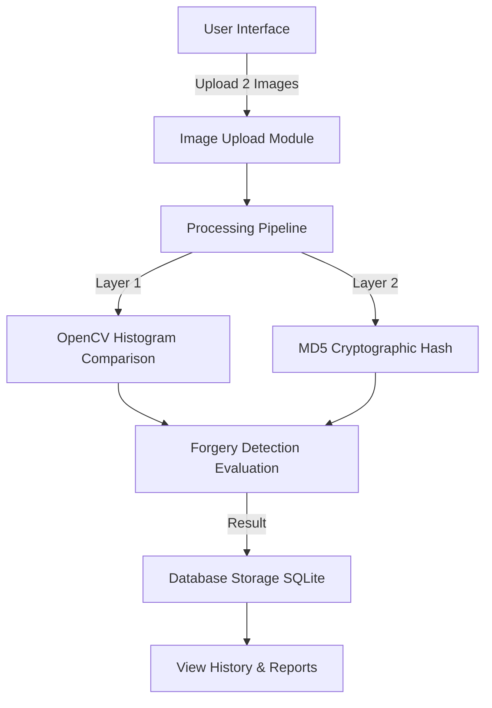

# Image Forgery Detection Using MD5 and OpenCV

An advanced digital image forensics and verification web application built with **Django**, **OpenCV**, and **MD5 Hashing**. This project provides a robust, dual-layered verification system to detect alterations, splicing, cloning, and metadata tampering in digital images.

---

## 📖 Project Overview & Abstract

With the rapid rise of sophisticated image editing tools, verifying the authenticity of digital images has become increasingly challenging. This project proposes a hybrid, dual-layered approach to detect image forgery:
1. **Cryptographic Check (MD5 Hashing):** Generates a unique digital fingerprint (hash) of each file. Any minor pixel or metadata change alters the hash value instantly.
2. **Visual Analysis (OpenCV):** Compares the grayscale histograms of the two images using the Euclidean distance metric. This detects structural and lighting similarities even if the files have different metadata or formats.

By merging the fast, lightweight verification of MD5 hashing with the deep pixel-level analysis of OpenCV, the system ensures a highly accurate and performant framework for content authentication, journalism validation, and digital forensics.

---

## 🛠️ System Architecture & Modules

The system is structured into six key modules:



### 1. User Interface Module
An interactive, responsive Django front-end built using customized Bootstrap CSS, allowing users to register, log in, upload image pairs, and view their detection history.

### 2. Image Upload Module
Allows authenticated users to upload two images (e.g., original vs. suspected forgery) in standard formats like JPEG and PNG. Uploads are securely stored in the database and mapped to the media root folder.

### 3. MD5 Hash Generation Module
Computes unique MD5 hashes for the uploaded images.
* If the hashes match, the files are structurally identical down to the byte level.
* If the hashes differ, it highlights that a byte-level modification or tampering has occurred.

### 4. OpenCV Visual Comparison Module
Generates 256-bin grayscale histograms for both images and calculates the **Euclidean Distance** between them:
$$d = \sqrt{\sum_{i=0}^{255} (h_1[i] - h_2[i])^2}$$
If the distance is less than the threshold (default: $20$), the images are flagged as visually similar.

### 5. Forgery Detection Evaluator
Combines the outputs of both modules. An image is flagged as **authentic (Same)** if and only if both the visual comparison and the cryptographic hash are identical. Otherwise, it is marked as **tampered (Different)**.

### 6. Database Storage Module
Uses SQLite to store registered user profiles and comparison reports, allowing users to review their complete history.

---

## 💻 Tech Stack & Dependencies

* **Back-end Web Framework:** Django 6.0.6 (Python 3.13+)
* **Computer Vision & Image Processing:** OpenCV (`opencv-python`)
* **Hashing Library:** `md5hash`
* **Front-end Technologies:** HTML5, CSS3 (Vanilla & Bootstrap), JavaScript (jQuery, Owl Carousel, WOW.js)
* **Database:** SQLite3

---

## 🚀 Installation & Setup Guide

### 1. Clone the Repository
```bash
git clone https://github.com/Nayum12/IMAGE-FORGERY-DETECTION-USING-MD5-AND-OPENCV-.git
cd "IMAGE FORGERY DETECTION USING OPENCV AND MD5"
```

### 2. Install Dependencies
Make sure you have Python 3.10+ installed. Install all required packages:
```bash
pip install -r requirements.txt
```

### 3. Apply Database Migrations
Set up your SQLite database tables:
```bash
python manage.py migrate
```

### 4. Run the Development Server
Start the local server:
```bash
python manage.py runserver
```
Once running, open your web browser and navigate to: **`http://127.0.0.1:8000/`**

---

## 📈 System Workflow & Usage

1. **Register & Login:** Users register a new account with their profile details and log in securely.
2. **Upload Images:** Access the **Upload Images** page, choose two files to compare, and hit **Detect Forgery**.
3. **View Results:** The system runs the dual-layered check, displays the results instantly, and stores the report.
4. **History Log:** Access **View Data** to see a history of all uploaded image pairs, including filenames, uploader email, and the classification status (Image is Same / Image is Different).

---

## 👥 Contributors & Institutional Details

This project was developed as a Final Year Project at:
* **Institution:** Annamacharya Institute of Technology & Sciences (Autonomous), Tirupati
* **Department:** Artificial Intelligence & Data Science (AIDS & AIML)
* **Batch Number:** 04
* **Project Guide:** Mrs. K. Jagadeeswari, M.Tech (PhD), Assistant Professor

### Team Members:
* **M. Nayum Basha** (Roll No: 21AK1A3051)
* **P. Lakshmi Priyanka** (Roll No: 21AK1A3033)
* **V. Ganesh** (Roll No: 21AK1A3017)
* **B. Mamatha** (Roll No: 21AK1A3037)

---

## 📄 License & Publication
This research work is published in the **Journal of Emerging Technologies and Innovative Research (JETIR)**.
* **Volume/Issue:** Volume 12, Issue 4, April 2025
* **ISSN:** 2349-5162
* **Document Ref:** JETIR2504550
