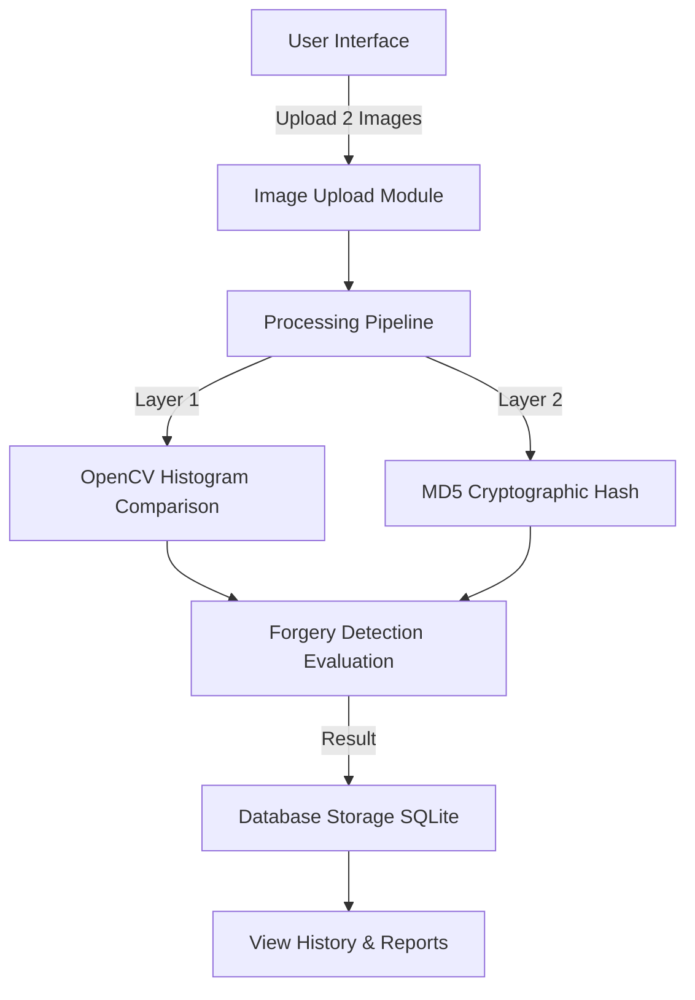
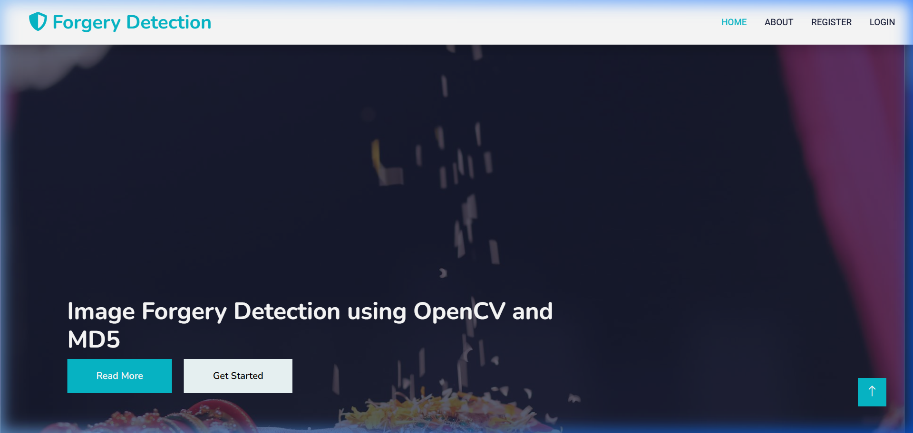
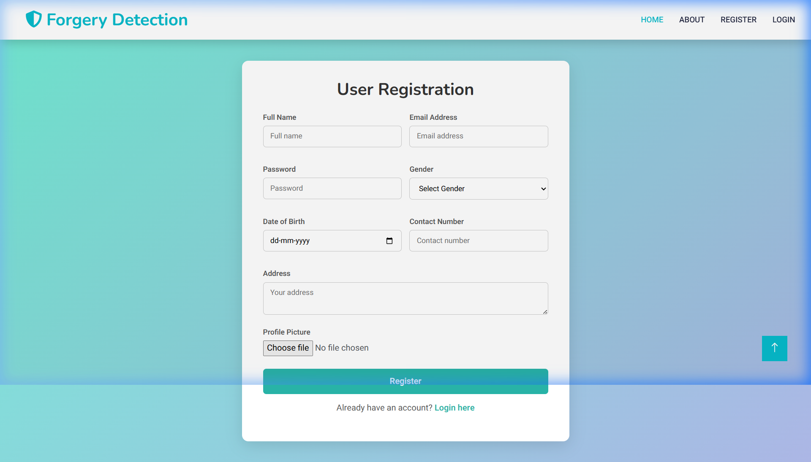
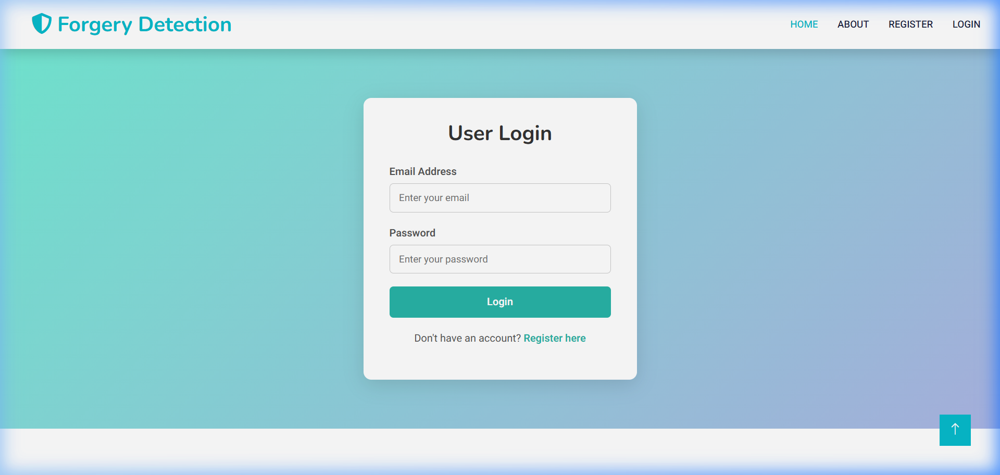

# Image Forgery Detection Using MD5 and OpenCV

🤖 **Academic Research Project**  
An advanced digital image forensics and verification web application built with **Django**, **OpenCV**, and **MD5 Hashing**. This project provides a robust, dual-layered verification system to detect alterations, splicing, cloning, and metadata tampering in digital images.

---

## 📊 Project Badges

[](https://www.python.org/)
[](https://www.djangoproject.com/)
[](https://opencv.org/)
[](LICENSE)
[](https://github.com/Nayum12/IMAGE-FORGERY-DETECTION-USING-MD5-AND-OPENCV-)

---

## 📖 Abstract & Summary

With the rapid rise of sophisticated image editing tools, verifying the authenticity of digital images has become increasingly challenging. This project proposes a hybrid, dual-layered approach to detect image forgery:
1. **Cryptographic Layer (MD5 Hashing):** Generates a unique digital fingerprint (hash) of each file. Any minor byte-level alteration (like modifying metadata or single pixels) changes the hash value instantly.
2. **Visual Processing Layer (OpenCV):** Compares the grayscale histograms of the two images using the Euclidean distance metric. This detects structural and lighting similarities even if the files have different formats, compression ratios, or metadata.

By merging the fast, lightweight verification of MD5 hashing with the deep pixel-level analysis of OpenCV, the system ensures a highly accurate and performant framework for content authentication, journalism validation, and digital forensics.

---

## ⚡ Key Features

* 🔐 **Secure User Authentication:** Custom registration and login forms with password hashing and session management.
* 🔄 **Dual-Layered Verification:** Combines fast byte-level cryptographic hashing (MD5) with visual similarity analysis (OpenCV Grayscale Histograms).
* 📊 **Detailed Analysis Logs:** Stores and displays past forgery comparison histories with status badges (e.g., *Image is Same* or *Image is Different*).
* 🎨 **Premium Modern Design:** Modern typography, curated HSL color palettes, responsive layouts, and smooth transition animations (built using customized Bootstrap and Owl Carousel).
* 🛠️ **Error Handling & Protection:** Gracefully catches invalid file uploads and database exceptions to keep the user experience seamless.

---

## 🛠️ System Architecture & Flow



### Modules Description:
* **Image Upload:** Validates file types and sizes. Accepts JPG, JPEG, and PNG.
* **MD5 Generator:** Computes hash signatures (`md5hash.scan`) to verify binary integrity.
* **Histogram Comparison:** Processes images in grayscale, generates 256-bin histograms, and computes the Euclidean distance:
  $$d = \sqrt{\sum_{i=0}^{255} (h_1[i] - h_2[i])^2}$$
* **Database & Logs:** Stores uploader metadata, filenames, and evaluation results.

---

## 📂 Project Directory Structure

```
IMAGE FORGERY DETECTION USING OPENCV AND MD5/
├── app/                  # Main application models
├── config/               # Django configuration and main URLs
│   ├── settings.py       # Global Django settings (Static/Media directories)
│   └── urls.py           # Core URL routing rules
├── docs/                 # Project documentation and ppts
│   ├── Journal/          # Academic journal paper (JETIR)
│   └── ppts/             # Presentation slide decks and abstract
├── forgery_detection/    # Feature implementation module
│   ├── detect.py         # Algorithm (OpenCV & MD5 comparison logic)
│   ├── models.py         # Database models for users and images
│   ├── urls.py           # Feature-level routing
│   └── views.py          # View functions and user request flows
├── static/               # CSS, JS, and image assets
│   ├── css/              # Main stylesheet and Bootstrap overrides
│   ├── img/              # Images, icons, and UI screenshots
│   └── js/               # Main script logic
├── templates/            # HTML templates with inheritance
│   ├── index.html        # Public-facing base template
│   ├── home.html         # Logged-in dashboard base template
│   └── *.html            # Functional child pages (login, upload, view)
├── manage.py             # Django entrypoint script
└── requirements.txt      # Python dependencies list
```

---

## 🖼️ Application Screenshots

### 🏠 Home Page
*The landing page displaying the project abstract and navigation options for guest users.*


### 📝 User Registration
*Secure registration form collecting user profile details, contact numbers, and profile pictures.*


### 🔑 User Login
*Secure login interface validating credentials to access the image upload panel.*


---

## 🚀 Installation & Setup Guide

Follow these steps to run the project locally on your system:

### 1. Prerequisites
Ensure you have the following installed on your machine:
* Python 3.10 or higher
* Git

### 2. Clone the Repository
```bash
git clone https://github.com/Nayum12/IMAGE-FORGERY-DETECTION-USING-MD5-AND-OPENCV-.git
cd "IMAGE FORGERY DETECTION USING OPENCV AND MD5"
```

### 3. Create a Virtual Environment (Recommended)
Set up an isolated environment to avoid dependency conflicts:
```bash
# On Windows
python -m venv venv
venv\Scripts\activate

# On macOS/Linux
python3 -m venv venv
source venv/bin/activate
```

### 4. Install Dependencies
```bash
pip install --upgrade pip
pip install -r requirements.txt
```

### 5. Apply Migrations & Initialize Database
Create local SQLite tables and prepare the schemas:
```bash
python manage.py migrate
```

### 6. Run the Development Server
```bash
python manage.py runserver
```
Visit **`http://127.0.0.1:8000/`** in your browser.

---

## 👥 Contributors & Institutional Details

This project was successfully designed and developed as a Final Year Project at:
* **Institution:** Annamacharya Institute of Technology & Sciences (Autonomous), Tirupati
* **Department:** Department of Artificial Intelligence & Data Science (AIDS & AIML)
* **Batch Number:** 04
* **Project Guide:** Mrs. K. Jagadeeswari, M.Tech (PhD), Assistant Professor

### Team Members:
* **M. Nayum Basha** (Roll No: 21AK1A3051)
* **P. Lakshmi Priyanka** (Roll No: 21AK1A3033)
* **V. Ganesh** (Roll No: 21AK1A3017)
* **B. Mamatha** (Roll No: 21AK1A3037)

---

## 📄 License & Publication

* **Journal Publication:** Published in the **Journal of Emerging Technologies and Innovative Research (JETIR)**.
* **Volume/Issue:** Volume 12, Issue 4, April 2025
* **ISSN:** 2349-5162
* **Ref/Paper ID:** JETIR2504550
* **License:** Distributed under the MIT License. See `LICENSE` for more information.
